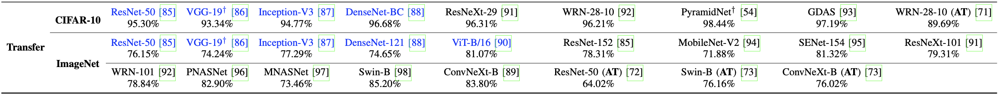
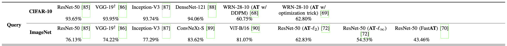

# BlackboxBench: A Comprehensive Benchmark of Black-box Adversarial Attacks

<p align="center">
 
</p>

<p align="center">
<a href="https://arxiv.org/abs/2312.16979"> Paper </a >•<a href="https://blackboxbench.github.io/index.html"> Leaderboard </a >
</p >

**BlackboxBench** is a comprehensive benchmark containing mainstream adversarial <u>**black-box attack methods**</u> implemented based on [PyTorch](https://pytorch.org/). It can be used to evaluate the adversarial robustness of any ML models, or as the baseline to develop more advanced attack and defense methods.


✨ BlackBoxBench will be continously updated by adding more attacks. ✨

✨ **You are welcome to contribute your black-box attack methods to BlackBoxBench!!**  See [how to contribute](#how-to-contribute)✨


---
<font size=5><center><b> Contents </b> </center></font>

- [Transfer-based attacks](#transfer-based-attacks)
    - [Quick start](#transfer-quick-start)
    - [Supported attacks](#transfer-supported-attacks)
    - [Supported datasets](#transfer-supported-datasets)
    - [Supported models](#transfer-supported-models)
- [Query-based attacks](#query-based-attacks)
   - [Quick start](#query-quick-start)
   - [Supported attacks](#query-supported-attacks)
   - [Supported datasets](#query-supported-dataset)
   - [Supported models](#query-supported-models)
- [Analysis Tools](#analysis-tools)
- [How to contribute](#how-to-contribute)
- [Citation](#citation)
- [Copyright](#copyright)
---

## <span id="transfer-based-attacks">Transfer-based attacks</span>

### <span id="transfer-quick-start">💡Quick start</span>

For `Requirements` and `Quick start` of transfer-based black-box adversarial attacks in BlackboxBench, please refer to the README [here](transfer/README.md). We also provide some model checkpoints for  users' convenience.

### <span id="transfer-supported-attacks">💡Supported attacks</span>

|                 |                         Config file                          | Paper                                                        |
| --------------- | :----------------------------------------------------------: | ------------------------------------------------------------ |
| I-FGSM          | [I-FGSM.json](transfer/config/NIPS2017/untargeted/l_inf/I-FGSM.json) | [Adversarial examples in the physical world](https://openreview.net/pdf?id=S1OufnIlx) ICLR 2017 |
| PGD             | [random_start.json](transfer/config/NIPS2017/untargeted/l_inf/random_start.json) | [Towards deep learning models resistant to adversarial attacks](https://openreview.net/pdf?id=rJzIBfZAb) ICLR 2018 |
| TI-FGSM         | [TI.json](transfer/config/NIPS2017/untargeted/l_inf/TI.json) | [Evading defenses to transferable adversarial examples by translation-invariant attacks](https://openaccess.thecvf.com/content_CVPR_2019/papers/Dong_Evading_Defenses_to_Transferable_Adversarial_Examples_by_Translation-Invariant_Attacks_CVPR_2019_paper.pdf) CVPR 2019 |
| SI-FGSM         | [SI.json](transfer/config/NIPS2017/untargeted/l_inf/SI.json) | [Nesterov accelerated gradient and scale invariance for adversarial attacks ](https://openreview.net/pdf?id=SJlHwkBYDH) ICLR 2020 |
| Admix           | [admix.json](transfer/config/NIPS2017/untargeted/l_inf/admix.json) | [Admix: Enhancing the transferability of adversarial attacks](https://openaccess.thecvf.com/content/ICCV2021/papers/Wang_Admix_Enhancing_the_Transferability_of_Adversarial_Attacks_ICCV_2021_paper.pdf) ICCV 2021 |
| DI2-FGSM        | [DI2-FGSM.json](transfer/config/NIPS2017/untargeted/l_inf/DI2-FGSM.json) | [Improving transferability of adversarial examples with input diversity](https://openaccess.thecvf.com/content_CVPR_2019/papers/Xie_Improving_Transferability_of_Adversarial_Examples_With_Input_Diversity_CVPR_2019_paper.pdf) CVPR 2019 |
| MI-FGSM         | [MI-FGSM.json](transfer/config/NIPS2017/untargeted/l_inf/MI-FGSM.json) | [Boosting adversarial attacks with momentum](https://openaccess.thecvf.com/content_cvpr_2018/papers/Dong_Boosting_Adversarial_Attacks_CVPR_2018_paper.pdf) CVPR 2018 |
| NI-FGSM         | [NI.json](transfer/config/NIPS2017/untargeted/l_inf/NI.json) | [Nesterov accelerated gradient and scale invariance for adversarial attacks](https://openreview.net/pdf?id=SJlHwkBYDH) ICLR 2020 |
| PI-FGSM         | [PI.json](transfer/config/NIPS2017/untargeted/l_inf/PI.json) | [Boosting adversarial transferability through enhanced momentum](https://www.bmvc2021-virtualconference.com/assets/papers/0646.pdf) BMVC 2021 |
| VT              | [VT.json](transfer/config/NIPS2017/untargeted/l_inf/VT.json) | [Enhancing the transferability of adversarial attacks through variance tuning](https://openaccess.thecvf.com/content/CVPR2021/papers/Wang_Enhancing_the_Transferability_of_Adversarial_Attacks_Through_Variance_Tuning_CVPR_2021_paper.pdf) CVPR 2021 |
| RAP             | [RAP.json](transfer/config/NIPS2017/untargeted/l_inf/RAP.json) | [Boosting the transferability of adversarial attacks with reverse adversarial perturbation](https://openreview.net/pdf?id=i7FNvHnPvPc) NIPS 2022 |
| LinBP           | [LinBP.json](transfer/config/NIPS2017/untargeted/l_inf/LinBP.json) | [Backpropagating linearly improves transferability of adversarial examples](https://proceedings.neurips.cc/paper/2020/file/00e26af6ac3b1c1c49d7c3d79c60d000-Supplemental.pdf) NIPS 2020 |
| SGM             | [SGM.json](transfer/config/NIPS2017/untargeted/l_inf/SGM.json) | [Skip connections matter: On the transferability of adversarial examples generated with resnets](https://openreview.net/pdf?id=BJlRs34Fvr) ICLR 2020 |
| ILA             | [ILA.json](transfer/config/NIPS2017/untargeted/l_inf/ILA.json) | [Enhancing adversarial example transferability with an intermediate level attack](https://openaccess.thecvf.com/content_ICCV_2019/papers/Huang_Enhancing_Adversarial_Example_Transferability_With_an_Intermediate_Level_Attack_ICCV_2019_paper.pdf) ICCV 2019 |
| FIA             | [FIA.json](transfer/config/NIPS2017/untargeted/l_inf/FIA.json) | [Feature importance-aware transferable adversarial attacks](https://openaccess.thecvf.com/content/ICCV2021/supplemental/Wang_Feature_Importance-Aware_Transferable_ICCV_2021_supplemental.pdf) ICCV 2021 |
| NAA             | [NAA.json](transfer/config/NIPS2017/untargeted/l_inf/NAA.json) | [Improving adversarial transferability via neuron attribution-based attacks](https://openaccess.thecvf.com/content/CVPR2022/papers/Zhang_Improving_Adversarial_Transferability_via_Neuron_Attribution-Based_Attacks_CVPR_2022_paper.pdf) CVPR 2022 |
| RD              | [RD.json](transfer/config/NIPS2017/untargeted/l_inf/RD.json) | [Lgv: Boosting adversarial example transferability from large geometric vicinity](https://www.ecva.net/papers/eccv_2022/papers_ECCV/papers/136640594.pdf) ECCV 2022 |
| GhostNet        | [GhostNet.json](transfer/config/NIPS2017/untargeted/l_inf/GhostNet.json) | [Learning transferable adversarial examples via ghost networks](https://arxiv.org/pdf/1812.03413.pdf) AAAI 2020 |
| DRA             | [DRA.json](transfer/config/NIPS2017/untargeted/l_inf/DRA.json) | [Toward understanding and boosting adversarial transferability from a distribution perspective](https://ieeexplore.ieee.org/stamp/stamp.jsp?arnumber=9917370) TIPS 2022 |
| IAA             | [IAA.json](transfer/config/NIPS2017/untargeted/l_inf/IAA.json) | [Rethinking adversarial transferability from a data distribution perspective](https://openreview.net/pdf?id=gVRhIEajG1k) ICLR 2022 |
| LGV             | [LGV.json](\transfer/config/NIPS2017/untargeted/l_inf/LGV.json) | [Lgv: Boosting adversarial example transferability from large geometric vicinity](https://www.ecva.net/papers/eccv_2022/papers_ECCV/papers/136640594.pdf) ECCV 2022 |
| SWA             | [SWA.json](transfer/config/NIPS2017/untargeted/l_inf/SWA.json) | [Making substitute models more bayesian can enhance transferability of adversarial examples](https://openreview.net/pdf?id=bjPPypbLre) ICLR 2023 |
| Bayesian attack | [Bayesian_attack.json](transfer/config/NIPS2017/untargeted/l_inf/Bayesian_attack.json) | [Making substitute models more bayesian can enhance transferability of adversarial examples](https://openreview.net/pdf?id=bjPPypbLre) ICLR 2023 |
| MI-DI           | [MI-DI.json](transfer/config/NIPS2017/untargeted/l_inf/MI-DI.json) | Composite attack (MI-FGSM + DI-FGSM)                         |
| MI-DI-TI        | [MI-DI-TI.json](transfer/config/NIPS2017/untargeted/l_inf/MI-DI-TI.json) | Composite attack (MI-FGSM + DI-FGSM + TI-FGSM)               |
| MI-DI-TI-SI     | [MI-DI-TI-SI.json](transfer/config/NIPS2017/untargeted/l_inf/MI-DI-TI-SI.json) | Composite attack (MI-FGSM + DI-FGSM + TI-FGSM + SI-FGSM)     |
| VMI             | [VMI.json](transfer/config/NIPS2017/untargeted/l_inf/VMI.json) | Composite attack (MI-FGSM + VT)                              |
| VNI             | [VNI.json](transfer/config/NIPS2017/untargeted/l_inf/VNI.json) | Composite attack (NI-FGSM + VT)                              |
| SI-RAP          | [SI-RAP.json](transfer/config/NIPS2017/untargeted/l_inf/SI-RAP.json) | Composite attack (SI-FGSM + RAP )                            |
| LGV-GhostNet    | [LGV-GhostNet.json](transfer/config/NIPS2017/untargeted/l_inf/LGV-GhostNet.json) | Composite attack (LGV + GhostNet )                           |

### <span id="transfer-supported-datasets">💡Supported datasets</span>

[CIFAR-10](https://cuhko365-my.sharepoint.com/:f:/g/personal/223040254_link_cuhk_edu_cn/EqWvrUrF82tEvHABSXaQ9aIBZACnOiJGG8Mu3UuChAEM0g?e=D3fOlk), [NIPS2017](https://cuhko365-my.sharepoint.com/:f:/g/personal/223040254_link_cuhk_edu_cn/Ev0mhoQdaftGgDZLQg_2Z_UB6CKUE8DyIc7oEbKYPmukow?e=bbhnlQ). Please first download these two datasets into `transfer/data/dataset`. 

### <span id="transfer-supported-models">💡Supported models</span>

BlackboxBench evaluates contained transfer-based attack methods on the below models 👇 (models in blue are treated as surrogate models). But users can attack any model trained on CIFAR-10 and ImageNet by adding it into BlackboxBench, following the step 1️⃣ in `Quick start`.




---
## <span id="query-based-attacks">Query-based attacks</span>

### <span id="query-quick-start">💡Quick start</span>

For `Requirements` and `Quick start` of query-based black-box adversarial attacks in BlackboxBench, please refer to the README [here](query/README.md). 

### <span id="query-supported-attacks">💡Supported attacks</span>

| Score-Based |File name| Paper|
| :------------- |:-------------|:-----|
| NES Attack   | [nes_attack.py](https://github.com/SCLBD/B-box/blob/main/attacks/score-based%20attacks/nes_attack.py) |[Black-box Adversarial Attacks with Limited Queries and Information](https://arxiv.org/abs/1804.08598) ICML 2018|
| ZO-signSGD  | [zo_sign_agd_attack.py](https://github.com/SCLBD/B-box/blob/main/attacks/score-based%20attacks/zo_sign_sgd_attack.py)  |[signSGD via Zeroth-Order Oracle](https://openreview.net/forum?id=BJe-DsC5Fm) ICLR 2019|
| Bandit Attack   | [bandit_attack.py](https://github.com/SCLBD/B-box/blob/main/attacks/score-based%20attacks/bandit_attack.py) |[Prior Convictions: Black-Box Adversarial Attacks with Bandits and Priors](https://arxiv.org/abs/1807.07978) ICML 2019|
| SimBA   | [simple_attack.py](https://github.com/SCLBD/B-box/blob/main/attacks/score-based%20attacks/simple_attack.py) |[Simple Black-box Adversarial Attacks](https://arxiv.org/abs/1905.07121) ICML 2019|
| ECO Attack  | [parsimonious_attack.py](https://github.com/SCLBD/B-box/blob/main/attacks/score-based%20attacks/parsimonious_attack.py) |[Parsimonious Black-Box Adversarial Attacks via Efficient Combinatorial Optimization](https://arxiv.org/abs/1905.06635) ICML 2019|
| Sign Hunter   | [sign_attack.py](https://github.com/SCLBD/B-box/blob/main/attacks/score-based%20attacks/sign_attack.py) |[Sign Bits Are All You Need for Black-Box Attacks](https://openreview.net/forum?id=SygW0TEFwH) ICLR 2020|
| Square Attack   | [square_attack.py](https://github.com/SCLBD/B-box/blob/main/attacks/score-based%20attacks/square_attack.py) |[Square Attack: a query-efficient black-box adversarial attack via random search](https://arxiv.org/abs/1912.00049) ECCV 2020|

| Decision-Based |File name| Paper|
| :------------- |:-------------|:-----|
| Boundary Attack | [boundary_attack.py](https://github.com/SCLBD/B-box/blob/main/attacks/decision-based%20attacks/boundary_attack.py) |[Decision-Based Adversarial Attacks: Reliable Attacks Against Black-Box Machine Learning Models](https://arxiv.org/abs/1712.04248) ICLR 2017|
| OPT   | [opt_attack.py](https://github.com/SCLBD/B-box/blob/main/attacks/decision-based%20attacks/opt_attack.py) |[Query-Efficient Hard-label Black-box Attack: An Optimization-based Approach](https://arxiv.org/abs/1807.04457) ICLR 2019|
| Sign-OPT   | [sign_opt_attack.py](https://github.com/SCLBD/B-box/blob/main/attacks/decision-based%20attacks/sign_opt_attack.py) | [Sign OPT: A Query Efficient Hard label Adversarial Attack](https://arxiv.org/abs/1909.10773) ICLR 2020|
| Evolutionary Attack  | [evo_attack.py](https://github.com/SCLBD/B-box/blob/main/attacks/decision-based%20attacks/evo_attack.py) |[Efficient Decision based Blackbox Adversarial Attacks on Face Recognition](https://arxiv.org/abs/1904.04433) CVPR 2019|
| GeoDA   | [geoda_attack.py](https://github.com/SCLBD/B-box/blob/main/attacks/decision-based%20attacks/geoda_attack.py) |[GeoDA: a geometric framework for blackbox adversarial attacks](https://arxiv.org/abs/2003.06468) CVPR 2020|
| HSJA   | [hsja_attack.py](https://github.com/SCLBD/B-box/blob/main/attacks/decision-based%20attacks/hsja_attack.py) | [HopSkipJumpAttack: A Query Efficient Decision Based Attack](https://arxiv.org/abs/1904.02144) IEEE S&P 2020|
| Sign Flip Attack   | [sign_flip_attack.py](https://github.com/SCLBD/B-box/blob/main/attacks/decision-based%20attacks/sign_flip_attack.py) |[Boosting Decision based Blackbox Adversarial Attacks with Random Sign Flip](https://www.ecva.net/papers/eccv_2020/papers_ECCV/html/2336_ECCV_2020_paper.php) ECCV 2020|
| RayS  | [rays_attack.py](https://github.com/SCLBD/B-box/blob/main/attacks/decision-based%20attacks/rays_attack.py) | [RayS: A Ray Searching Method for Hard-label Adversarial Attack](https://arxiv.org/abs/2006.12792) KDD 2020|

### <span id="query-supported-dataset">💡Supported datasets</span>

[CIFAR-10](https://www.cs.toronto.edu/~kriz/cifar.html), [ImageNet](https://www.kaggle.com/c/nips-2017-non-targeted-adversarial-attack/overview/dataset). Please first download these two datasets into `query/data/`. Here, we test the contained attack methods on the whole CIFAR-10 testing set and ImageNet competition dataset comprised of [1000 samples](https://drive.google.com/file/d/1QGldLJtVXCU_hG6XYY5ju48W4X1ioA7l/view?usp=sharing).

### <span id="query-supported-models">💡Supported models</span>

BlackboxBench evaluates contained query-based attack methods on the below models 👇. But users can attack any model trained on CIFAR-10 and ImageNet by adding it into BlackboxBench, following the step 1️⃣ in `Quick start`.




---

## <span id="analysis-tools">Analysis tools</span>

Analysis tools will be released soon!


---

## <span id="how-to-contribute">How to contribute</span>

You are welcome to contribute your black-box attacks or defenses to BlackBoxBench! 🤩

In the following sections there are some tips on how to prepare you attack.

### 🚀 Adding a new transfer-based attack

##### 👣 Core function

We divide various efforts to improve I-FGSM into four distinct perspectives: data, optimization, feature and model. Attacks belonging to different perspectives can be implemented by modifying below blocks:

[input_transformation.py](transfer/input_transformation.py): the block registering various input transformation functions. Attacks from data perspective are most likely to happen here. For example, the key of DI-FGSM is randomly resizing the image, so its core function is defined here:

```
@Registry.register("input_transformation.DI")
def DI(in_size, out_size):
    def _DI(iter, img, true_label, target_label, ensemble_models, grad_accumulate, grad_last, n_copies_iter):
        ...
        return padded
    return _DI
```

[loss_function.py](transfer/loss_function.py): the block registering various loss functions. Attacks from feature perspective are most likely to happen here. For example, the key of FIA is designing a new loss function, so its core function is defined here:

```
@Registry.register("loss_function.fia_loss")
def FIA(fia_layer, N=30, drop_rate=0.3):
    ...
    def _FIA(args, img, true_label, target_label, ensemble_models):
        ...
        return -loss if args.targeted else loss
    return _FIA
```

[gradient_calculation.py](transfer/gradient_calculation.py): the block registering various ways to calculate gradients. Attacks from optimization perspective are most likely to happen here. For example, the key of SGM is using gradients more from the skip connections, so its core function is defined here:

```
@Registry.register("gradient_calculation.skip_gradient")
def skip_gradient(gamma):
		...
    def _skip_gradient(args, iter, adv_img, true_label, target_label, grad_accumulate, grad_last, input_trans_func, ensemble_models, loss_func):
        ...
        return gradient
    return _skip_gradient
```

[update_dir_calculation.py](transfer/update_dir_calculation.py): the block registering various ways to calculate update direction on adversarial examples. Attacks from optimization perspective are most likely to happen here. For example, the key of MI is using the accumulated gradient as update direction, so its core function is defined here:

```
@Registry.register("update_dir_calculation.momentum")
def momentum():
    def _momentum(args, gradient, grad_accumulate, grad_var_last):
        ...
        return update_dir, grad_accumulate
    return _momentum
```

[model_refinement.py](transfer/model_refinement.py): the block registering various ways to refine the surrogate model. Attacks from model perspective are most likely to happen here. For example, the key of LGV is finetune model with a high learning rate, so its core function is defined here:

```
@Registry.register("model_refinement.stochastic_weight_collecting")
def stochastic_weight_collecting(collect, mini_batch=512, epochs=10, lr=0.05, wd=1e-4, momentum=0.9):
    def _stochastic_weight_collecting(args, rfmodel_dir):
        ...
    return _stochastic_weight_collecting
```

Design your core function and register it in the suitable `.py` file to fit into our unified attack pipeline.

##### 👣 Config file

 You should also fill a json file which is structured in the following way and put it in `transfer/config/<DATASET>/<TARGET>/<L-NORM>/<YOUR-METHOD>.py`. Here is an example from [transfer/config/NIPS2017/untargeted/l_inf/I-FGSM.json](transfer/config/NIPS2017/untargeted/l_inf/I-FGSM.json)):

```
{
  "source_model_path": ["NIPS2017/pretrained/resnet50"],
  "target_model_path": ["NIPS2017/pretrained/resnet50",
                        "NIPS2017/pretrained/vgg19_bn",
                        "NIPS2017/pretrained/resnet152"],
  "n_iter": 100,
  "shuffle": true,
  "batch_size": 200,
  "norm_type": "inf",
  "epsilon": 0.03,
  "norm_step": 0.00392157,
  "seed": 0,
  "n_ensemble": 1,
  "targeted": false,
  "save_dir": "./save",

  "input_transformation": "",
  "loss_function": "cross_entropy",
  "grad_calculation": "general",
  "backpropagation": "nonlinear",
  "update_dir_calculation": "sgd",
  "source_model_refinement": ""
}
```

Make sure your core function is well specified in the last six fields.


---

## <span id="citation">Citation</span>

If you want to use BlackboxBench in your research, cite it as follows:

```
@article{zheng2025blackboxbench,
  title={Blackboxbench: A comprehensive benchmark of black-box adversarial attacks},
  author={Zheng, Meixi and Yan, Xuanchen and Zhu, Zihao and Chen, Hongrui and Wu, Baoyuan},
  journal={IEEE Transactions on Pattern Analysis and Machine Intelligence},
  year={2025}
}
```


---

## <span id="copyright">Copyright</span>

The source code of this repository is licensed by [The Chinese University of Hong Kong, Shenzhen](https://www.cuhk.edu.cn/en) under Creative Commons Attribution-NonCommercial 4.0 International Public License (identified as [CC BY-NC-4.0 in SPDX](https://spdx.org/licenses/)). More details about the license could be found in [LICENSE](./LICENSE).

This project is built by the Secure Computing Lab of Big Data ([SCLBD](http://scl.sribd.cn/index.html)) at The Chinese University of Hong Kong, Shenzhen, directed by Professor [Baoyuan Wu](https://sites.google.com/site/baoyuanwu2015/home). SCLBD focuses on research of trustworthy AI, including backdoor learning, adversarial examples, federated learning, fairness, etc.
